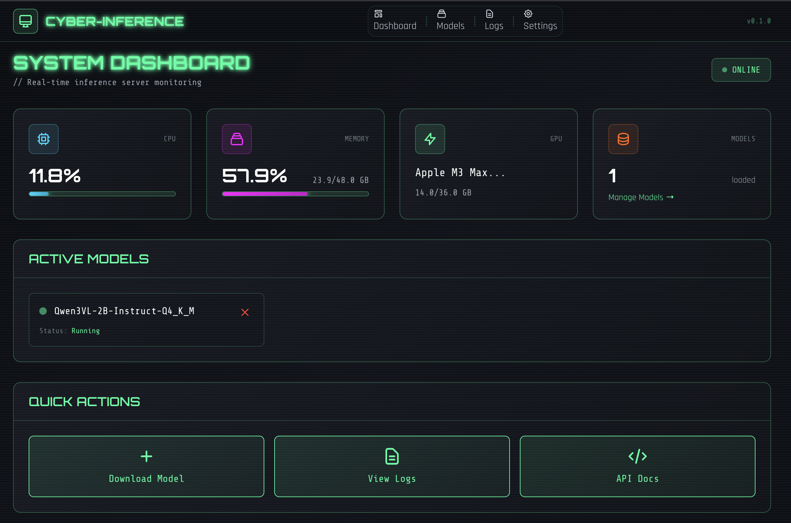

# Cyber-Inference

<p align="center">
  
  
  
  
  
  
</p>

<p align="center">
  
  <strong>Edge inference server management with an OpenAI-compatible API</strong>
</p>

Cyber-Inference is a web GUI and API server for running local inference engines behind OpenAI-compatible `/v1` endpoints. It supports:
- `llama.cpp` for GGUF models
- `transformers` for full HuggingFace model directories
- `whisper.cpp` for transcription/translation

## Features

- OpenAI-compatible API (`/v1/chat/completions`, `/v1/completions`, `/v1/embeddings`, `/v1/audio/*`)
- Model download + registration from HuggingFace
- Automatic lazy loading and idle unloading
- Web dashboard for model and resource management
- Optional admin auth (JWT)
- Docker and docker-compose support (CPU + NVIDIA)
- NVIDIA and Apple Silicon friendly deployment paths

## Inference Engines

| Engine | Model Format | Typical Hardware | Primary Use |
| --- | --- | --- | --- |
| `llama.cpp` | GGUF | CPU / Apple Metal / CUDA | Quantized local chat + embeddings |
| `transformers` | HuggingFace directory (`config.json`, safetensors, tokenizer) | CPU / CUDA / MPS | Full HF model inference |
| `whisper.cpp` | Whisper GGUF/bin | CPU / Apple Metal / CUDA | Speech transcription and translation |

## Quick Start

### One-shot startup

```bash
git clone https://github.com/ramborogers/cyber-inference.git
cd cyber-inference
./start.sh
```

`start.sh` will:
1. Ensure `uv` is available.
2. Validate Python 3.12+.
3. Detect NVIDIA GPU/CUDA.
4. Run `uv sync`.
5. Verify CUDA-enabled PyTorch on NVIDIA machines.
6. Start `cyber-inference serve` with auto-restart.

### Manual setup

```bash
uv sync
uv run cyber-inference init
uv run cyber-inference serve --reload
```

Open the UI at `http://localhost:8337`.

## Model Download

Use the **Models** page in the UI or the CLI.

### CLI examples

```bash
# Auto-select engine (GGUF for GGUF repos, transformers for full HF repos)
uv run cyber-inference download-model ggml-org/Qwen3-4B-GGUF
uv run cyber-inference download-model Qwen/Qwen2.5-7B-Instruct

# Force engine
uv run cyber-inference download-model ggml-org/gpt-oss-20b-GGUF --engine gguf
uv run cyber-inference download-model nvidia/NVIDIA-Nemotron-3-Nano-30B-A3B-FP8 --engine transformers

# List local models
uv run cyber-inference list-models
```

## API Usage

### Python (OpenAI SDK)

```python
from openai import OpenAI

client = OpenAI(base_url="http://localhost:8337/v1", api_key="not-needed")

resp = client.chat.completions.create(
    model="Qwen3-4B-Q4_K_M",
    messages=[{"role": "user", "content": "hello"}],
)
print(resp.choices[0].message.content)
```

### cURL

```bash
curl http://localhost:8337/v1/chat/completions \
  -H "Content-Type: application/json" \
  -d '{
    "model": "Qwen3-4B-Q4_K_M",
    "messages": [{"role": "user", "content": "hello"}]
  }'
```

## Docker

### CPU

```bash
docker-compose up -d
```

### NVIDIA GPU

```bash
docker-compose -f docker-compose.nvidia.yml up -d
```

### Jetson

```bash
docker-compose -f docker-compose.jetson.yml up -d
```

## Configuration

Environment variables use the `CYBER_INFERENCE_` prefix.

| Variable | Default | Description |
| --- | --- | --- |
| `CYBER_INFERENCE_HOST` | `0.0.0.0` | API bind host |
| `CYBER_INFERENCE_PORT` | `8337` | API bind port |
| `CYBER_INFERENCE_DATA_DIR` | `./data` | Database + logs directory |
| `CYBER_INFERENCE_MODELS_DIR` | `./models` | Model storage directory |
| `CYBER_INFERENCE_DEFAULT_CONTEXT_SIZE` | `8192` | Default context for llama.cpp |
| `CYBER_INFERENCE_MAX_CONTEXT_SIZE` | `32768` | Max allowed context |
| `CYBER_INFERENCE_MODEL_IDLE_TIMEOUT` | `300` | Idle unload timeout in seconds |
| `CYBER_INFERENCE_MAX_LOADED_MODELS` | `1` | Max simultaneously loaded models |
| `CYBER_INFERENCE_MAX_MEMORY_PERCENT` | `80` | Memory pressure threshold |
| `CYBER_INFERENCE_LLAMA_GPU_LAYERS` | `-1` | llama.cpp GPU layer setting |
| `CYBER_INFERENCE_ADMIN_PASSWORD` | unset | Enables admin auth when set |
| `CYBER_INFERENCE_HF_TOKEN` | unset | HuggingFace token for private repos |

## Admin Endpoints

- `GET /admin/status`
- `GET /admin/resources`
- `GET /admin/models`
- `POST /admin/models/download`
- `POST /admin/models/download-transformers`
- `POST /admin/models/{model}/load`
- `POST /admin/models/{model}/unload`
- `DELETE /admin/models/{model}`
- `GET /admin/config`
- `PUT /admin/config/{key}`

## Development

```bash
uv sync
uv run pytest
uv run ruff check .
uv run mypy src/
```

## License

GPL-3.0
