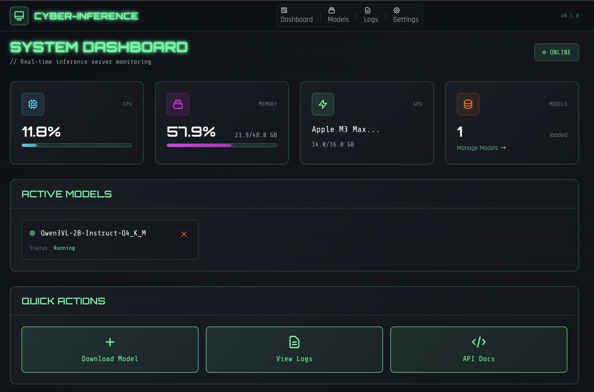

# Cyber-Inference

<p align="center">
  
  
  
  
  
  
</p>

<p align="center">
  
  <strong>Edge inference server management with an OpenAI-compatible API</strong>
</p>

Cyber-Inference is a web GUI and API server for running local inference engines behind OpenAI-compatible `/v1` endpoints. It supports:
- `llama.cpp` for GGUF models
- `transformers` for full HuggingFace model directories
- `whisper.cpp` for transcription/translation

Current release: `0.2.0`

## Features

- OpenAI-compatible API (`/v1/chat/completions`, `/v1/completions`, `/v1/embeddings`, `/v1/audio/*`)
- Model download + registration from HuggingFace, including split GGUF shard sets
- Automatic lazy loading and idle unloading
- Web dashboard for model and resource management
- Optional admin auth (JWT)
- NVIDIA-only published container images for Linux AMD64 and Thor ARM64
- Native local startup paths for macOS Apple Silicon and non-container development

## Inference Engines

| Engine | Model Format | Typical Hardware | Primary Use |
| --- | --- | --- | --- |
| `llama.cpp` | GGUF | CPU / Apple Metal / CUDA | Quantized local chat + embeddings |
| `transformers` | HuggingFace directory (`config.json`, safetensors, tokenizer) | CPU / CUDA / MPS | Full HF model inference |
| `whisper.cpp` | Whisper GGUF/bin | CPU / Apple Metal / CUDA | Speech transcription and translation |

## Quick Start

### One-shot startup

```bash
git clone https://github.com/ramborogers/cyber-inference.git
cd cyber-inference
./start.sh
```

`start.sh` will:
1. Ensure `uv` is available.
2. Validate Python 3.12+.
3. Detect NVIDIA GPU/CUDA.
4. Run `uv sync`.
5. Verify CUDA-enabled PyTorch on NVIDIA machines.
6. Start `cyber-inference serve` with auto-restart.

### Manual setup

```bash
uv sync
uv run cyber-inference init
uv run cyber-inference serve --reload
```

Open the UI at `http://localhost:8337`.

## Model Download

Use the **Models** page in the UI or the CLI.

Cyber-Inference handles GGUF repositories that publish one model across multiple shard files such as
`Model-00001-of-00003.gguf`, `Model-00002-of-00003.gguf`, and `Model-00003-of-00003.gguf`.
The downloader presents the shard set as one logical model choice, downloads any missing shards,
skips complete shards on repeat runs, and registers one canonical model entry.

### CLI examples

```bash
# Auto-select engine (GGUF for GGUF repos, transformers for full HF repos)
uv run cyber-inference download-model ggml-org/Qwen3-4B-GGUF
uv run cyber-inference download-model Qwen/Qwen2.5-7B-Instruct

# Force engine
uv run cyber-inference download-model ggml-org/gpt-oss-20b-GGUF --engine gguf
uv run cyber-inference download-model nvidia/NVIDIA-Nemotron-3-Nano-30B-A3B-FP8 --engine transformers

# Split GGUF repos are handled as one logical model.
# Passing the first shard or a later shard downloads the full shard set.
uv run cyber-inference download-model <org>/<split-gguf-repo> --filename Model-00001-of-00003.gguf

# List local models
uv run cyber-inference list-models
```

## API Usage

### Python (OpenAI SDK)

```python
from openai import OpenAI

client = OpenAI(base_url="http://localhost:8337/v1", api_key="not-needed")

resp = client.chat.completions.create(
    model="Qwen3-4B-Q4_K_M",
    messages=[{"role": "user", "content": "hello"}],
)
print(resp.choices[0].message.content)
```

### cURL

```bash
curl http://localhost:8337/v1/chat/completions \
  -H "Content-Type: application/json" \
  -d '{
    "model": "Qwen3-4B-Q4_K_M",
    "messages": [{"role": "user", "content": "hello"}]
  }'
```

## Docker

Cyber-Inference publishes NVIDIA-only container images for the two supported deployment targets:

| Target | Image |
| --- | --- |
| Linux AMD64 NVIDIA hosts | `ghcr.io/ramborogers/cyber-inference:linux-amd64` |
| Thor / DGX Spark ARM64 NVIDIA hosts | `ghcr.io/ramborogers/cyber-inference:thor-arm64` |

Both images expect durable host directories mounted into the container:

- `./data` → `/app/data` for the database and logs
- `./models` → `/app/models` for downloaded model files

The Linux AMD64 image does not ship a bundled `llama.cpp`; on startup, Cyber-Inference attempts to
download the latest compatible `llama-server` into `/app/bin`, so the container needs outbound
network access on first boot. The Thor image bakes in the current `llama.cpp` build produced on
`thor.lab` during the publish workflow, then smoke-tests that binary with the NVIDIA runtime enabled
after the image is built.

Docker is **not** the recommended path for macOS Apple Silicon MPS. On macOS, use the native local
startup flow above so Metal/MPS support is available directly from the host.

### Linux AMD64 NVIDIA

```bash
mkdir -p data models

docker pull ghcr.io/ramborogers/cyber-inference:linux-amd64

docker run -d --name cyber-inference \
  --gpus all \
  -p 8337:8337 \
  -v "$PWD/data:/app/data" \
  -v "$PWD/models:/app/models" \
  ghcr.io/ramborogers/cyber-inference:linux-amd64
```

### Thor / DGX Spark ARM64 NVIDIA

```bash
mkdir -p data models

docker pull ghcr.io/ramborogers/cyber-inference:thor-arm64

docker run -d --name cyber-inference \
  --runtime nvidia \
  -p 8337:8337 \
  -v "$PWD/data:/app/data" \
  -v "$PWD/models:/app/models" \
  ghcr.io/ramborogers/cyber-inference:thor-arm64
```

### Upgrade while preserving local state

Use the same host `data` and `models` directories when replacing a container. Pick the target tag for
your host (`linux-amd64` or `thor-arm64`) and restart with the same mounts:

```bash
TARGET_TAG=linux-amd64  # or thor-arm64

docker stop cyber-inference
docker rm cyber-inference
docker pull "ghcr.io/ramborogers/cyber-inference:${TARGET_TAG}"

docker run -d --name cyber-inference \
  --gpus all \
  -p 8337:8337 \
  -v "$PWD/data:/app/data" \
  -v "$PWD/models:/app/models" \
  "ghcr.io/ramborogers/cyber-inference:${TARGET_TAG}"
```

For Thor hosts that require the NVIDIA runtime flag instead of `--gpus all`, replace that line with:

```bash
  --runtime nvidia \
```

## Configuration

Environment variables use the `CYBER_INFERENCE_` prefix.

| Variable | Default | Description |
| --- | --- | --- |
| `CYBER_INFERENCE_HOST` | `0.0.0.0` | API bind host |
| `CYBER_INFERENCE_PORT` | `8337` | API bind port |
| `CYBER_INFERENCE_DATA_DIR` | `./data` | Database + logs directory |
| `CYBER_INFERENCE_MODELS_DIR` | `./models` | Model storage directory |
| `CYBER_INFERENCE_DEFAULT_CONTEXT_SIZE` | `8192` | Default context for llama.cpp |
| `CYBER_INFERENCE_MAX_CONTEXT_SIZE` | `32768` | Max allowed context |
| `CYBER_INFERENCE_MODEL_IDLE_TIMEOUT` | `300` | Idle unload timeout in seconds |
| `CYBER_INFERENCE_MODEL_LOAD_TIMEOUT` | `300` | Startup readiness timeout in seconds |
| `CYBER_INFERENCE_PRE_MODEL_LOAD_COMMAND_ENABLED` | `false` | Run host command before model startup |
| `CYBER_INFERENCE_PRE_MODEL_LOAD_COMMAND` | `sudo sysctl -w vm.drop_caches=3` | Host command for pre-model load preparation |
| `CYBER_INFERENCE_PRE_MODEL_LOAD_COMMAND_TIMEOUT` | `15` | Pre-load command timeout in seconds |
| `CYBER_INFERENCE_MAX_LOADED_MODELS` | `1` | Max simultaneously loaded models |
| `CYBER_INFERENCE_MAX_MEMORY_PERCENT` | `80` | Memory pressure threshold |
| `CYBER_INFERENCE_LLAMA_GPU_LAYERS` | `-1` | llama.cpp GPU layer setting |
| `CYBER_INFERENCE_ADMIN_PASSWORD` | unset | Enables admin auth when set |
| `CYBER_INFERENCE_HF_TOKEN` | unset | HuggingFace token for private repos |

Large models can take several minutes before their backend server reports ready. The
`Model Load Timeout (seconds)` admin setting controls how long Cyber-Inference waits during model
startup before treating the load as failed. If startup times out, the launched backend process is
terminated and its port is released.

Thor/DGX Spark operators can enable `Run pre-model load command` in Admin Settings to clear Linux
disk/page cache before loading very large models. The default command is
`sudo sysctl -w vm.drop_caches=3`; configure passwordless sudo or run Cyber-Inference in a service
context that can execute the command without an interactive prompt. In this first release, public
`/v1` API lazy-loads skip the pre-load command; use the Admin UI load action when the host needs the
cache-clear hook before startup.

## Admin Endpoints

- `GET /admin/status`
- `GET /admin/resources`
- `GET /admin/models`
- `GET /admin/models/repo-files`
- `POST /admin/models/download`
- `POST /admin/models/download-transformers`
- `POST /admin/models/{model}/load`
- `POST /admin/models/{model}/unload`
- `DELETE /admin/models/{model}`
- `GET /admin/config`
- `PUT /admin/config/{key}`

## Development

```bash
uv sync
uv run pytest
uv run ruff check .
uv run mypy src/
```

## License

GPL-3.0
